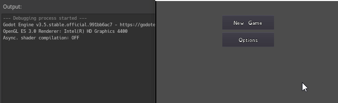

# Omnis
A Simon four color memory game clone with some new modes. At least I planned some, to make the game more challenging and also go for some accessibility features and replay value to train good design. Made with Godot to learn using game engines.

